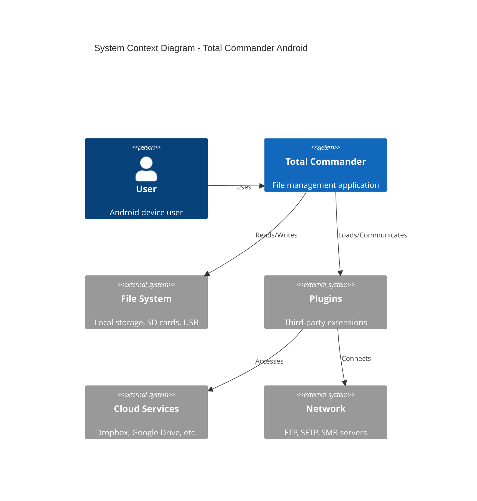
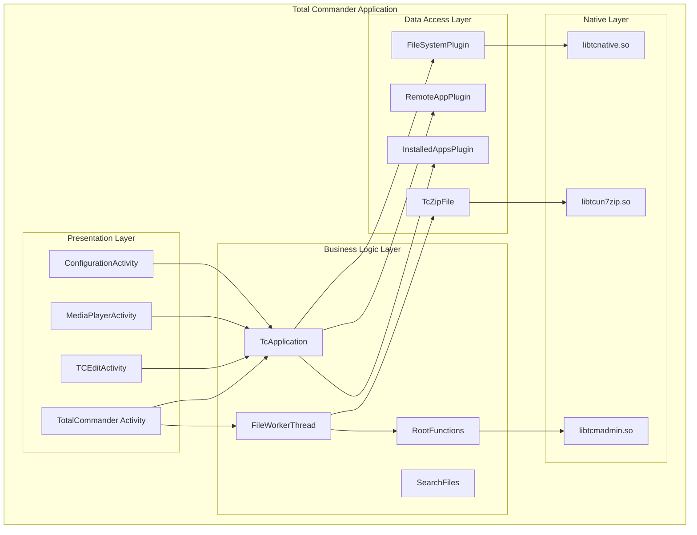
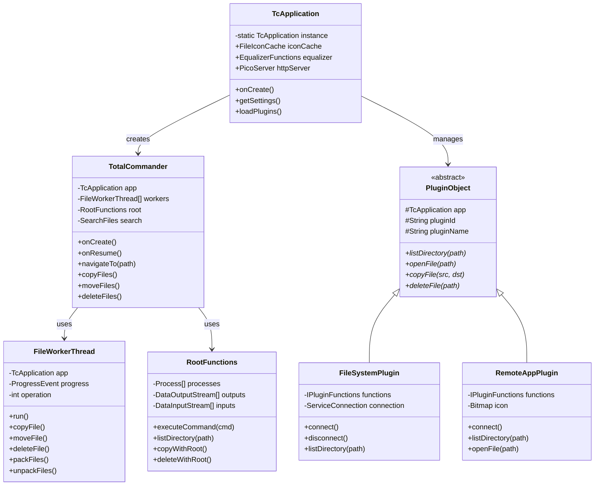
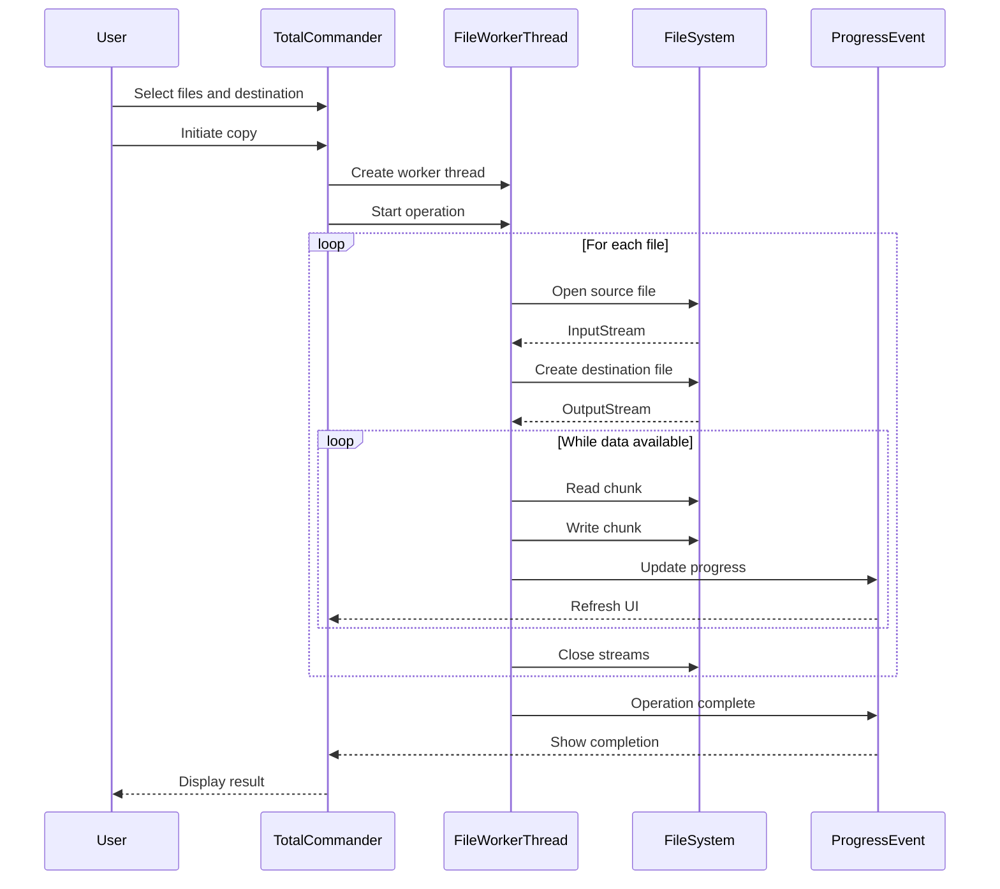
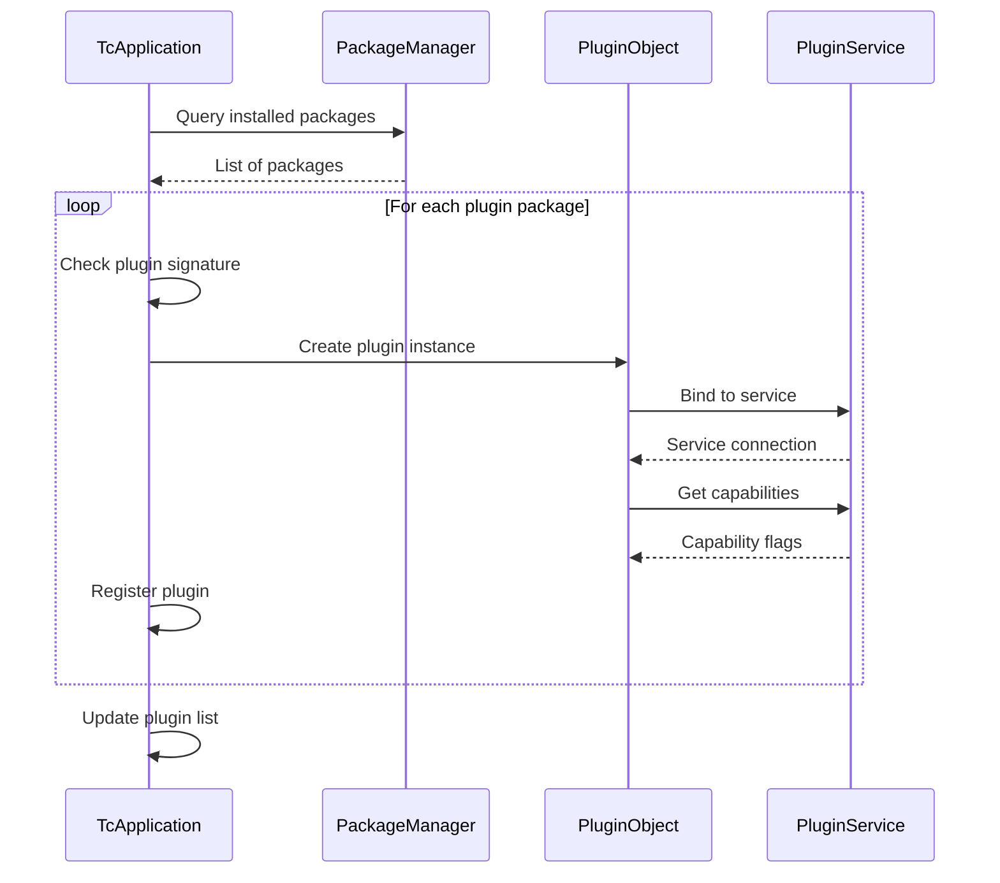
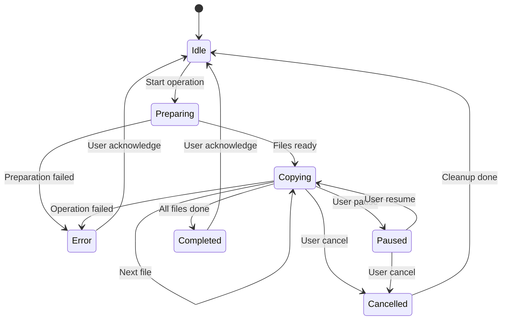
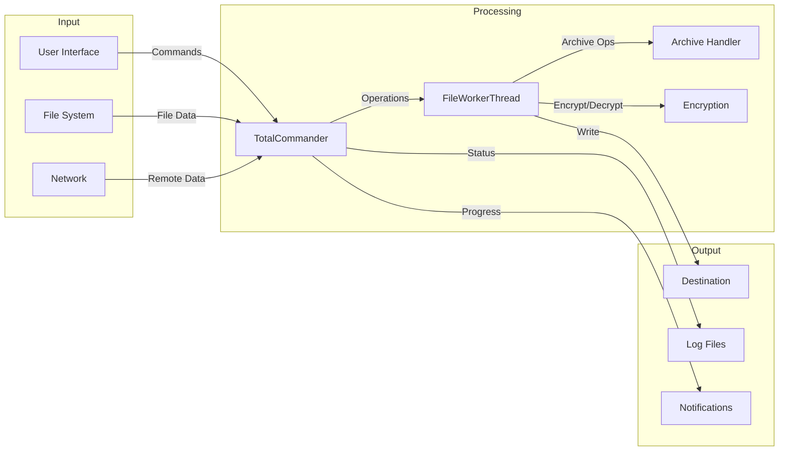
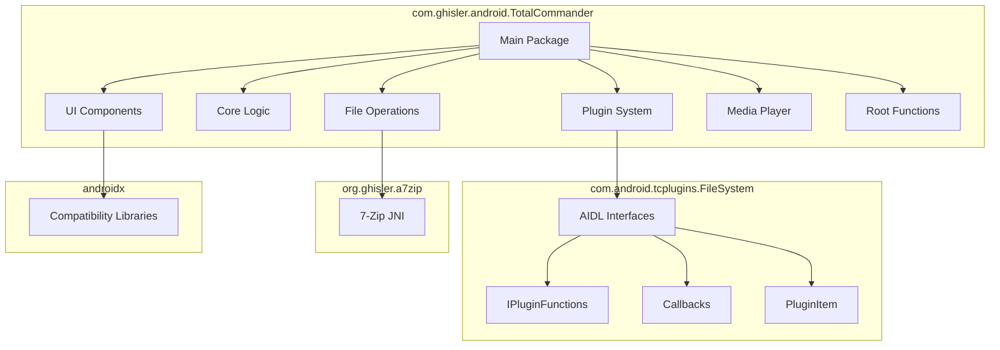
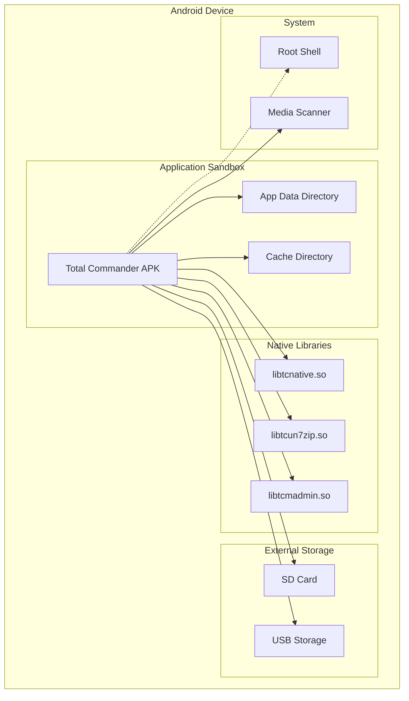
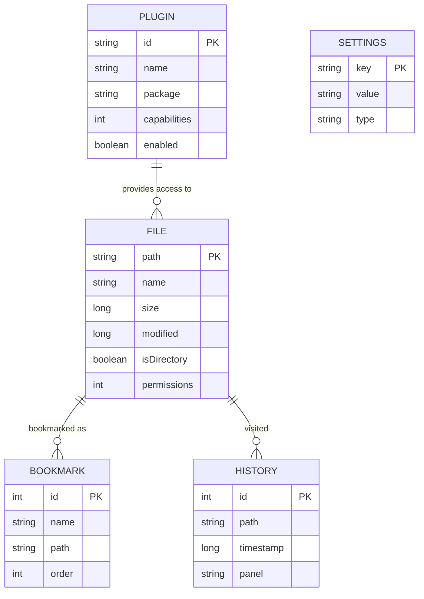

# Total Commander Android: Architecture Diagrams

This document contains detailed Mermaid diagrams illustrating the architecture of Total Commander for Android.

## 1. System Context Diagram

## 2. Component Diagram

## 3. Class Diagram - Core Classes

## 4. Sequence Diagram - File Copy Operation

## 5. Sequence Diagram - Plugin Loading

## 6. State Diagram - File Operation States

## 7. Data Flow Diagram

## 8. Package Diagram

## 9. Deployment Diagram

## 10. Entity Relationship Diagram

