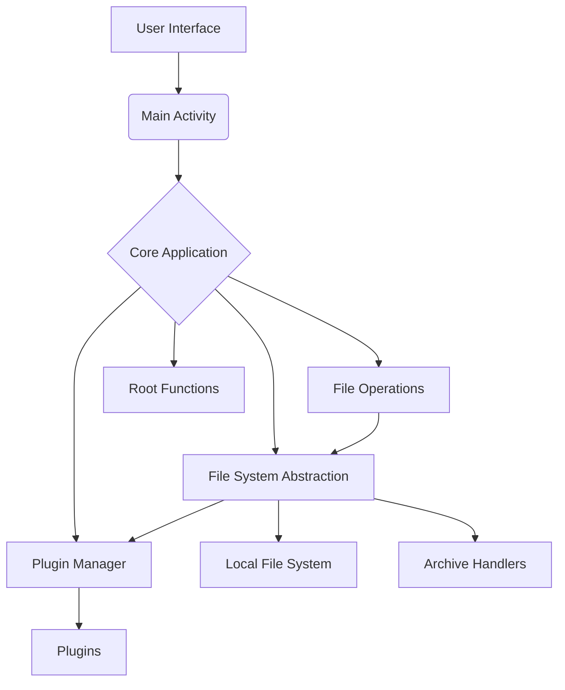
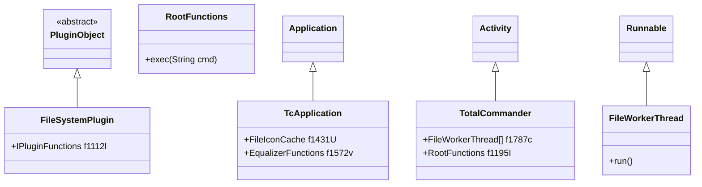
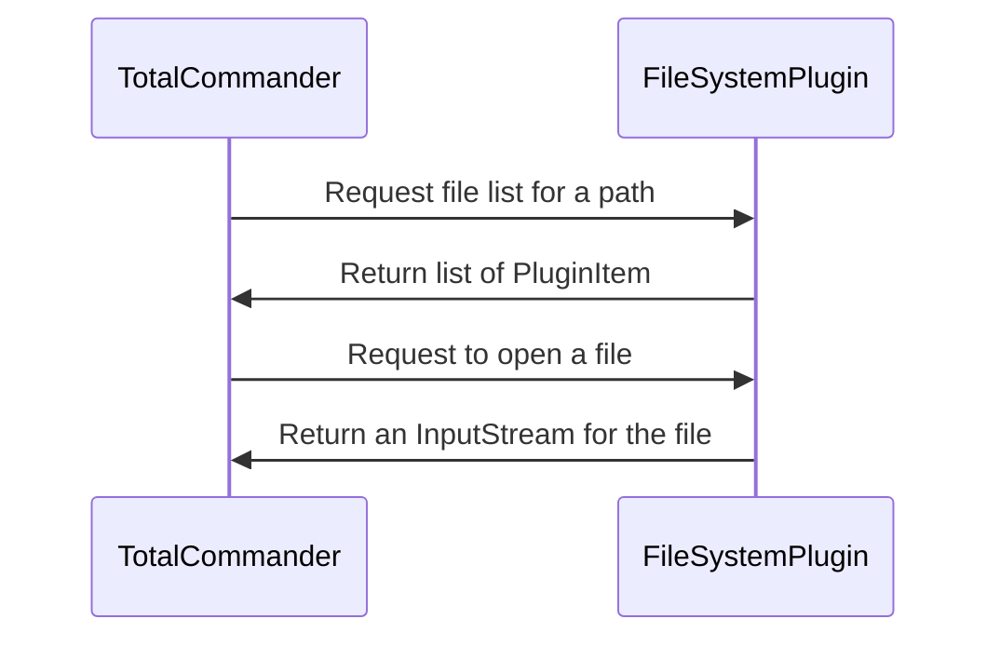
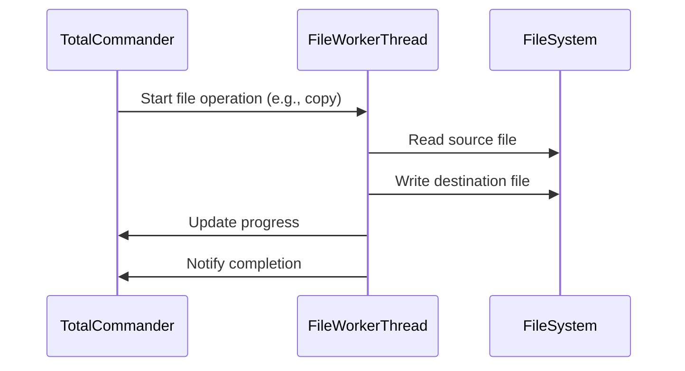
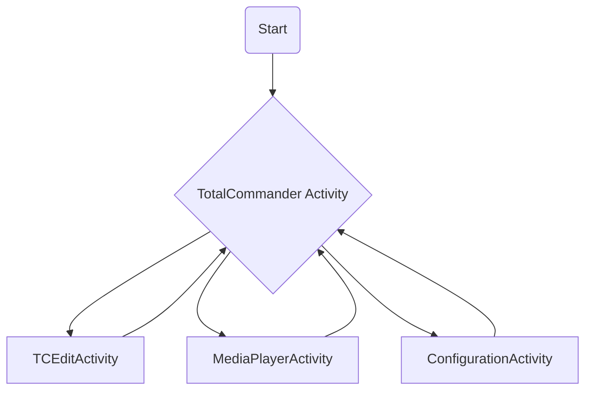

# Total Commander for Android: Technical Documentation

This document provides a detailed technical overview of the Total Commander for Android application, including its architecture, core components, and key functionalities. The analysis is based on the decompiled APK.

## 1. Introduction

Total Commander for Android is a feature-rich file manager that brings the power and flexibility of its desktop counterpart to the Android platform. It offers a dual-pane interface, extensive file and archive handling capabilities, a robust plugin system, and support for root operations. This document delves into the technical implementation details of the application to provide a comprehensive understanding of its internal workings.

## 2. Architecture Overview

The application follows a modular architecture, with a clear separation of concerns between the UI, core logic, and file system operations. The main components are:

*   **Core Application (`TcApplication`)**: The central class that manages the application's lifecycle, global state, and settings.
*   **Main Activity (`TotalCommander`)**: The primary UI component that hosts the dual-pane file browser and handles user interactions.
*   **File System Abstraction**: A set of classes that provide a unified interface for accessing different file systems, including the local file system, archives, and network locations via plugins.
*   **Plugin System**: A powerful mechanism for extending the application's functionality with new file systems, tools, and features.
*   **File Operations**: A set of classes responsible for handling file operations such as copy, move, delete, and archive extraction.
*   **Root Functions**: A dedicated module for performing privileged operations that require root access.

### High-Level Architecture Diagram

## 3. Core Components

### 3.1. `TcApplication`

The `TcApplication` class serves as the singleton instance of the application and is responsible for:

*   Initializing and managing global application state.
*   Loading and saving application settings.
*   Managing the lifecycle of plugins and other core components.
*   Providing access to shared resources and utilities.

### 3.2. `TotalCommander` Activity

The `TotalCommander` activity is the main entry point of the application and is responsible for:

*   Displaying the dual-pane file browser.
*   Handling user input and gestures.
*   Coordinating file operations and other user-initiated actions.
*   Managing the lifecycle of the main UI components.

### 3.3. Class Hierarchy

## 4. Plugin Architecture

Total Commander's plugin system is a key feature that allows for seamless integration of third-party extensions. The plugin architecture is based on a set of well-defined interfaces that plugins must implement to provide their services to the main application.

### 4.1. Plugin Types

*   **File System Plugins**: Provide access to new file systems, such as cloud storage services, network shares, and other remote locations.
*   **Content Plugins**: Allow other applications to access files managed by Total Commander.

### 4.2. Plugin Interaction

## 5. File Operations

File operations are handled by the `FileWorkerThread` class, which runs in the background to avoid blocking the main UI thread. The `FileWorkerThread` is responsible for performing tasks such as copying, moving, deleting, and packing/unpacking files and directories.

### 5.1. File Operation Sequence

## 6. Root Operations

Total Commander provides a set of functions for performing operations that require root access. These functions are encapsulated in the `RootFunctions` class and are executed using the `su` command. The `RootFunctions` class provides a safe and reliable way to interact with the system at a privileged level.

## 7. UI and Main Activities

The application's UI is centered around the `TotalCommander` activity, which provides the main dual-pane file browser. Other key activities include:

*   `TCEditActivity`: A simple text editor for viewing and editing text files.
*   `MediaPlayerActivity`: A media player for playing audio and video files.
*   `ConfigurationActivity`: Allows users to customize the application's settings.

### 7.1. Activity Lifecycle

## 8. Conclusion

Total Commander for Android is a well-engineered application with a modular and extensible architecture. Its clear separation of concerns, robust plugin system, and powerful file management capabilities make it a versatile and indispensable tool for Android power users. This technical documentation provides a comprehensive overview of the application's design and implementation, which can serve as a valuable resource for developers and researchers interested in understanding its inner workings.
